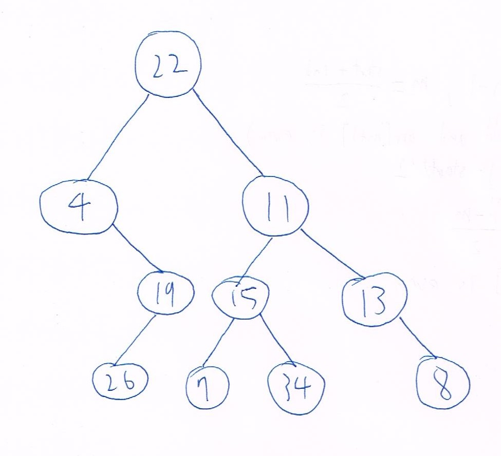
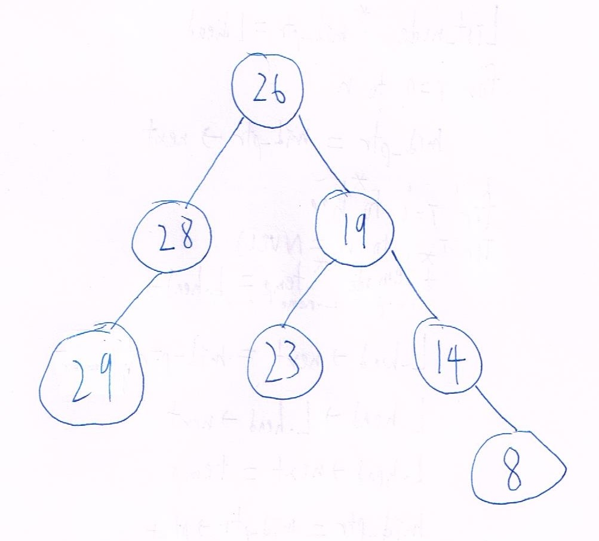
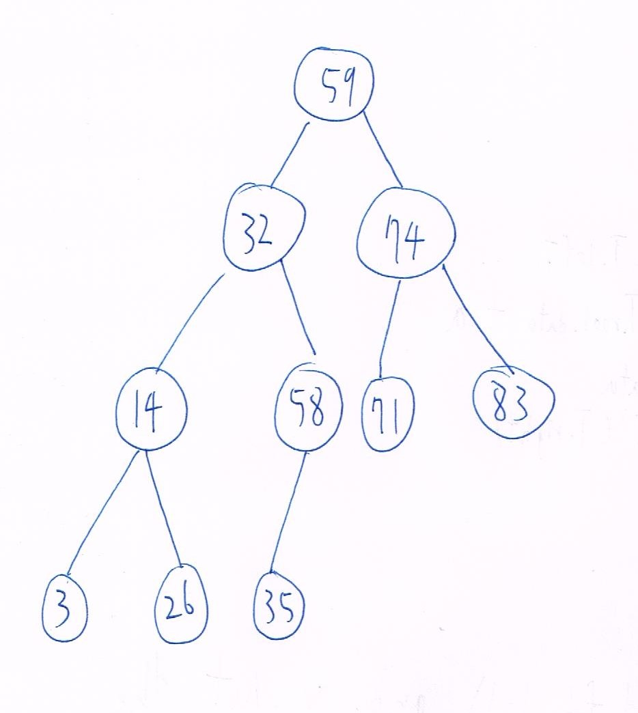

## DSA HW-2  
### Problem 0:  
1. 李沛宸 B10902032
2. 李沛宸 B10902032
3. 李沛宸 B10902032
4. 李沛宸 B10902032
5. 李沛宸 B10902032
### Problem 1:  
1. Tree:  
     
   Human algorithm: In a postorder traversal it's last node in that subtree will be it's root, so we can cut the tree in half by looking at the inorder traversal, cause the nodes at the left side of the root are in the left subtree and right side in the right subtree. By doing this we can reconstruct the tree.

2. Tree:  
     

3. Algorithm:  
   ```C
    int a = 0
    modify_T(root):
        if root is nullptr:
            return
        else:
            modify_T(root->right)
            int temp = root->data
            root->data += a
            a += temp
            modify_T(root->left)
   ```  
   The time complexity is O(n) cause it traverse through n node with O(1) operation to the node.  
   The algorithm works by traversing from the largest node to the smallest node, and adjust the data in the node by adding the sum of the value of every node that has been traversed, which is the nodes that are larger than it.
4. Prove:  
    1. Let x be a leaf node and y's left child, assume z is a node smaller than y then z must be in y's left subtree, however x is the only node in y's left subtree, so by contradict y must be the smallest node among all nodes larger than x  
    2. Let x be a leaf node and y's right child, assume z is a node larger than y then z must be in y's right subtree, however x is the only node in y's right subtree, so by contradict must be the largest node among all nodes smaller than x  
    3. By the 2 fact above we can prove that y is either the smallest node among all nodes larger than x, or the largest node among all nodes smaller than x, when x is a leaf node and y is its parent.  
   
5. Tree:  
      

6. Algorithm:  
   ```C
    height(root):
        if root is nullptr:
            return 0
        else
            return 1 + max(height(root->left), height(root->left))
    wasted_positions_num = pow(2, height(root)) - 1 - n
   ```  
   The time complexity is O(n) cause the recursive fuction traverse through n nodes with O(1) operations during the traverse  
   The algorithm works cause we know that the number of nodes in a complete binary tree are 2^height - 1, so the wated positions in an array will be 2^height - 1 - n  

### Problem 2:  
1. Algoritm:  
   ```C
   find_max_min():
        stack = empty stack
        

        for i = 1 to i = n - 2:


   ```
