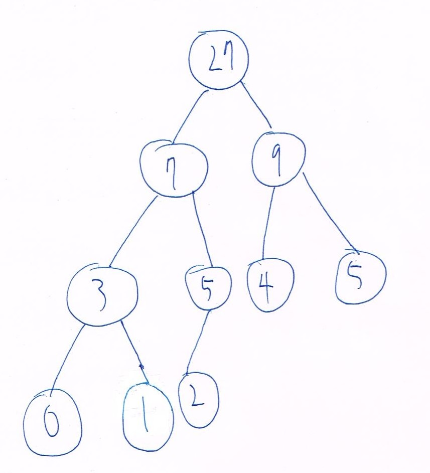
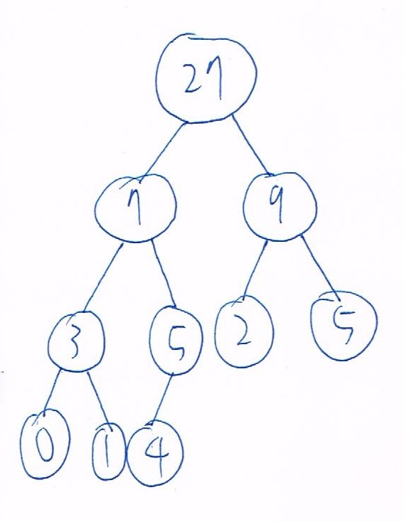
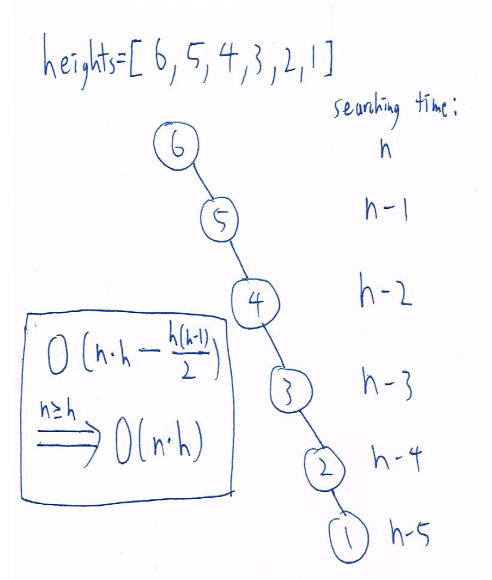

## B10902033 林祐辰 DSA HW-2  
### Problem 0:  
1. 李沛宸 B10902032
2. 李沛宸 B10902032
3. 李沛宸 B10902032
4. 李沛宸 B10902032
5. 李沛宸 B10902032
### Problem 1:  
1. Tree:  
     
   Human algorithm: In a postorder traversal it's last node in that subtree will be it's root, so we can cut the tree in half by looking at the inorder traversal, cause the nodes at the left side of the root are in the left subtree and right side in the right subtree. By doing this we can reconstruct the tree.  

2. Tree:  
     

3. Algorithm:  
   ```C
   int a = 0
   modify_T(root):
      if root is nullptr:
         return
      else:
         modify_T(root->right)
         root->data += a
         a = root->data
         modify_T(root->left)
   ```  
   The time complexity is O(n) cause it traverse through n node with O(1) operation to the node.  
   The algorithm works by traversing from the largest node to the smallest node, and adjust the data in the node by adding the sum of the value of every node that has been traversed, which is the nodes that are larger than it.  

4. Prove:  
    1. Let x be a leaf node and y's left child, assume z is a node smaller than y then z must be in y's left subtree, however x is the only node in y's left subtree, so by contradict y must be the smallest node among all nodes larger than x.  
    2. Let x be a leaf node and y's right child, assume z is a node larger than y then z must be in y's right subtree, however x is the only node in y's right subtree, so by contradict must be the largest node among all nodes smaller than x.  
    3. By the 2 fact above we can prove that y is either the smallest node among all nodes larger than x, or the largest node among all nodes smaller than x, when x is a leaf node and y is its parent.  
   
5. Tree:  
      
   </br>  

6. Algorithm:  
   ```C
   height(root):
      if root is nullptr:
         return 0
      else
         return 1 + max(height(root->left), height(root->left))
   wasted_positions_num = pow(2, height(root)) - 1 - n
   ```  
   The time complexity is O(n) cause the recursive fuction traverse through n nodes with O(1) operations during the traverse.  
   The algorithm works cause we know that the number of nodes in a complete binary tree are 2^height - 1, so the wated positions in an array will be 2^height - 1 - n.  

### Problem 2:  
1. Algoritm:  
   ```C
   start = 1
   end = n
   find_max_min(start, end):
      stack = empty stack
      push(stack, start)  //push and pop both finish in O(1) operations
      push(stack, start + 1)
      for i =  start = 2 to i = end:
         push(stack, i)
         a = pop(stack), b = pop(stack), c = pop(stack)
         if query_attitude_value(a, b, c) == True:
            push(stack, a)
            push(stack, c)
         else if query_attitude_value(a, c, b) == True
            push(stack, a)
            push(stack, b)
         else
            push(stack, b)
            push(stack, c)
      max_min = {pop(stack), pop(stack)}
      return max_min    
   ```
   The query complexity is O(n), because the for loop interations are n-2, and each iteration needs O(1) query complexty.  
   The algorithm works by using a stack to store max and min value, and because by asking for query at most two times we can always get the max and min among three values.  
   </br>  
   </br>  
   </br>  

2. Algoritm:  
   ```C
   add_new_group(sorted_array, n)   //function in 2-3
   sorted_array = empty array
   make_sorted_array(sorted_array, n):
      if query_attitude_value(1, 2, 3) == True:
         sorted_array[1] = 1
         sorted_array[2] = 2
         sorted_array[3] = 3
      else if query_attitude_value(1, 3, 2) == True:
         sorted_array[1] = 1
         sorted_array[2] = 3
         sorted_array[3] = 2
      else:
         sorted_array[1] = 2
         sorted_array[2] = 1
         sorted_array[3] = 3
      for i = 3 to n-1:
         add_new_group(sorted_array, i)
   ```  
   The query complexity is O(n * log n), because the for loop has n-2 iterations and query complexity for add_new_group is atmost O(log n-1), so the total query complexity is O(n * log n).  
   The algorithn works by making a sorted array of the first three groups than insert the groups behind it with the function add_new_group.
   
3. Algoritm:  
   ```C
   add_new_group(sorted_array, n):
      a = 1, b = n
      if query_attitude_value(sorted_array[a], sorted_array[b], n+1) == True:
         sorted_array[n+1] = n+1
         return
      else if query_attitude_value(n+1, sorted_array[a], sorted_array[b]) == True:
         insert n+1 into sorted_array[1]
         return
      else:
         while(1):
            if a == b-1:
               if query_attitude_value(sorted_array[a], n+1, sorted_array[b]) == True:
                  insert n+1 into sorted_array[b]
                  return
               else:
                  insert n+1 into sorted_array[b+1]
                  return
            else:
               if query_attitude_value(sorted_array[a], n+1, sorted_array[b]) == True:
                  b = a + (b - a) / 2
               else:
                  temp = a
                  a = b
                  b += (b - temp) / 2
   ```  
   The query complexity is O(log n), because for every query we can cut the searching range in half till a = b-1.  
   The algorithm works by squeezing the searching range, because if n+1 doesn't fits in the searching range than it must fits somewhere in the left-hand side.
   
4. Skip  
   
5. There are 14 "good triplets" 

6. Algoritm:  
   ```C
   stack = empty stack
   find_good_triplets(n):
      for i = 1 to n:
         for j = 1 to n:
            if i == j:
               continue
            for k =1 to n:
               if j == k or i == k:
                  continue
               if query_attitude_value(i,j,k) == True and query_terrible_value(i,j,k) == True:
                  push(stack, {i,j,k})
   ```  
   The query complexity is apparently O(n^3).  
   The algorithm works by method of exhaustion, and try every group one by one.  

   Here is two other method that I have think of but doesn't have time to adjust it into pseudo code:  
   1. O(n^2) query complexity:  
      first step: sort attitude values in O(nlog n) and get the sorted array Q.  
      second step: choose j from 2 to n-1, and scan the left side and right side j. The ones that are 左小右大 or 左大右小, will be a pair of good triplets.This step takes O(n^2).
   2. O(nlog n) query complexity:  
      first step: sort attitude values in O(nlog n) and get the sorted array Q.  
      second step: by using the think of insertion sort we can get what we want above in O(nlog n).  
   </br>  
   </br>  
   </br>

### Problem 3:  
1. Tree:  
     

2. Tree:  
      

3. Algorithm:  
   ```C
   find_max_value_index(heights, a, b):
      max = 0
      index = 0
      for i = a to b:
         if heights[i] > max
            max = heights[i]
            index = i
      return index
   build_cartesian_tree(root, heights, a, b):  //intially a = 0, b = n - 1
      if a == b:
         return
      else:
         index = find_max_value_index(heights, a, b)
            root->data = heights[index]
            root->index = index  //O(n) extra space for problem 4,5,6
            build_cartesian_tree(root->left, heights, a, index-1)
            build_cartesian_tree(root->right, heights, index+1, b)
   ```  
   The time complexity is O(n * h) because to complete every floor of the tree it will take (n-c) times for searching the max index.  
    Example for the worst case:  
       
    The algorithm works by finding the index of the max value between index a and index b and cutting the tree in half. By the property of cartesian tree we know that the nodes in the left subtree will be at the left side of the root index in the array and same as the right subtree, also the root value will be the max value in its subtree.  

4. Algorithm:  
   ```C
   find_index_value(root, index):
      if root->index == index:
         return root->data
      else if root->index < index:
         find_index_value(root->right, index)
      else if root->index > index:
         find_index_value(root->left, index)
   ```  
   The time complexity is O(log n) cause the worst case is when it traverse to the leaf, which is determined by the depth of the tree.  
   The algorithm works by cutting of impossible cases, because we know that the index larger than the root index must be in its right subtree and smaller ones in the left subtree, so we only need to tranverse through the subtree that have the index in it.  

5. Algorithm:  
   ```C
   find_max_value(root, left, right):
      if left >= right:
         return 0   //invalid situation
      if left <= root->index < right:
         return root->data
      else if root->index < left:
         find_max_value(root->right, index)
      else if root->index >= right:
         find_index_value(root->left, index)
   ```  
   The time complexity is O(log n) cause the worst case is when left = right-1, which means it will traverse to the leaf with at most depth's operation.  
   The algorithm works by finding there lowest common ancestor, with similar thoughts from problem 3, we only need to check the subtree with the answer.  

6. Algorithm:  
   ```C
   visible_building_stack = empty stack
   visible_heights_stack = empty stack
   a = 0
   left_hand_side_view(root):
      if root == nullptr:
         return
      else:
         left_hand_side_view(root->left)
         push(visible_building_stack, root->index)
         push(visible_heights_stack, root->data - a)
         a = root->data
   ``` 
   The time complexity is O(log n) because the function will traverse through the left-most chain in the tree which depth is at most log n.  
   The algorithm works by kowing that the left-most chain in the cartesian tree will be the buildings we need, cause its the only chain in the tree which is monotonically increasing in both index and value in the nodes.  
